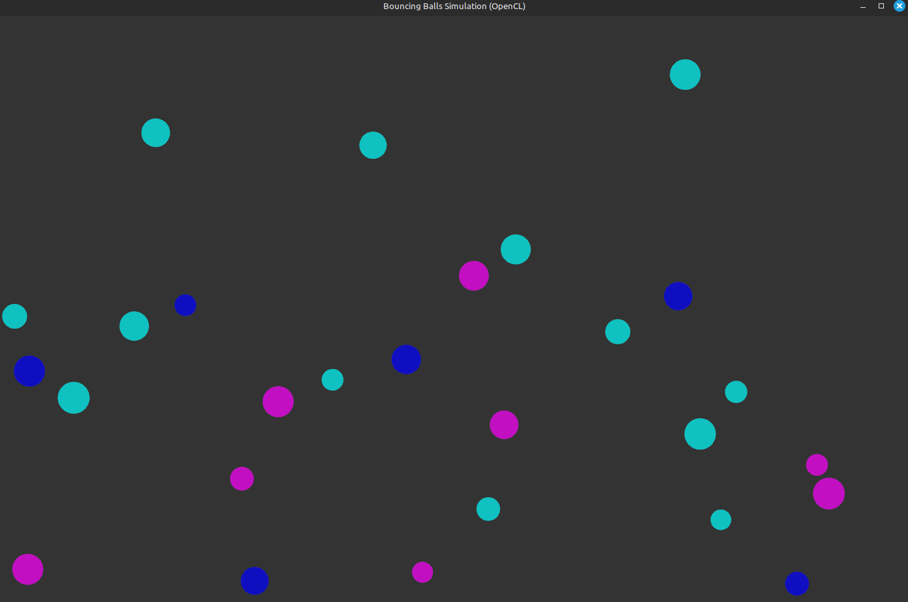

# Multicore Physics Simulation Engine

A real-time C++ simulation engine that demonstrates multicore programming techniques by simulating thousands of bouncing balls in parallel. Physics simulation and rendering are decoupled across threads, leveraging CPU cores for performance and responsiveness. Rendering is powered by OpenGL with custom shaders.

---

## 🚀 Features

- Parallelized particle physics simulation using multithreading
- Real-time rendering with OpenGL and GLSL shaders
- Modular design with decoupled simulation, rendering, and input threads
- Thread-safe communication and synchronization (atomic ops, mutexes)
- Efficient GPU data management via a custom `GPUManager` module

---

## 🧠 Technologies

- C++17
- OpenGL
- GLSL
- Multithreading (C++ std::thread)
- CMake
- GLFW
- GLEW

---

## 📦 Dependencies

Install these using your system package manager (for Ubuntu/Debian):

```bash
sudo apt update
sudo apt install cmake g++ libglfw3-dev libglew-dev libglm-dev
```

> You’ll also need a system with OpenGL support (GPU driver installed).

---

## 🛠️ Project Structure

```
/src
  ├── main.cpp              # Application entry point
  ├── Renderer.cpp/h        # OpenGL rendering engine
  ├── Simulation.cpp/h      # Physics simulation logic
  ├── GPUManager.cpp/h      # Manages data transfer to GPU
  ├── Ball.h                # Ball object definition
  ├── Config.h              # Simulation parameters
CMakeLists.txt
```

---

## 🧪 How to Build & Run

1. **Clone the repository:**

```bash
git clone https://github.com/your-username/multicore-physics-sim.git
cd multicore-physics-sim
```

2. **Build the project using CMake:**

```bash
mkdir build && cd build
cmake ..
make
```

3. **Run the executable:**

```bash
./bouncing_balls
```
## 📸 Demo




---
## 📚 Learning Outcomes

- Applied multicore programming concepts in a real-time setting
- Built a performant, thread-safe simulation and rendering pipeline
- Gained experience with OpenGL, graphics programming, and systems architecture

---

## 📄 License

MIT License. See `LICENSE` file for more details.
